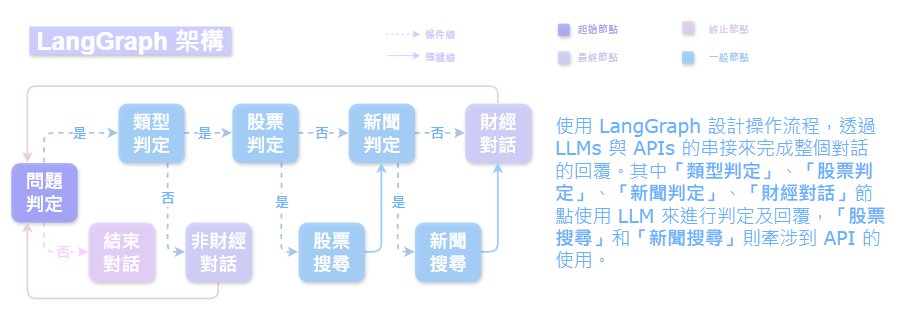

# OinkVest： 大型語言模型財經聊天機器人
OinkVest 是一個基於大型語言模型的 Line 聊天機器人，透過自然語言與使用者進行互動，即時回覆有關財經、投資等近期相關資訊。



## 功能
- 使用 LLM 和 LangChain 進行自然語言理解和生成。
- 串接 News API 獲取對話時所需相關文件。
- 使用 LangGraph 判定 LLM 和 API 的調用，以避免資源過度使用。
- 透過 RAG 技術使 LLM 能根據外部文件提供更即時具體的回答。
- 串接 Line Bot API 獲取 Line 聊天介面。

## 使用系統及工具
- Python 3.11.0
- VS Code (串接 Line Bot 時使用)
- Ngrok (串接 Line Bot 時使用)

## 操作步驟
### 使用 LLM 財經助理 (不包含 Line Bot)
1. 申請金鑰。
2. 將 `InputYourAPIKeys.env` 重新命名為 `.env` 並填寫所有 API 金鑰。
3. 下載 `requirement.txt` 中的所有套件。
```
pip install -r requirements.txt
```
4. 執行 `llm_financial_assistany.ipynb`。
### 額外使用 Line Bot (詳情可參考網路資源：[Line Bot 教學](https://www.youtube.com/watch?v=Mw3cODdkaFM&t=1426s))
5. 在 Line Developers 申請官方帳號，建立 Message API channel。
6. 啟用 Ngrok 連接本地伺服器和 Line 伺服器。
7. 啟用 VS Code 的 Python Debugger (使用 Flask)。

## 金鑰需求
| 名稱 | 描述 | 備註 |
| ---- | ---- | ---- |
| OPENAI_API_KEY | 您的 OpenAI API 金鑰 | 必填 |
| LANGCHAIN_API_KEY | 您的 LANGCHAIN API 金鑰 | 選填 |
| NEWS_API_KEY | 您的 NEWS API 金鑰 | 必填 |
| ACCESS_TOKEN | 您的 Channel access token (long-lived) | 串接 Line Bot 必填 |
| CHANNEL_SECRET | 您的 Channel secret | 串接 Line Bot 必填 |

## 呈現
### 程式執行介面

### Line 介面


